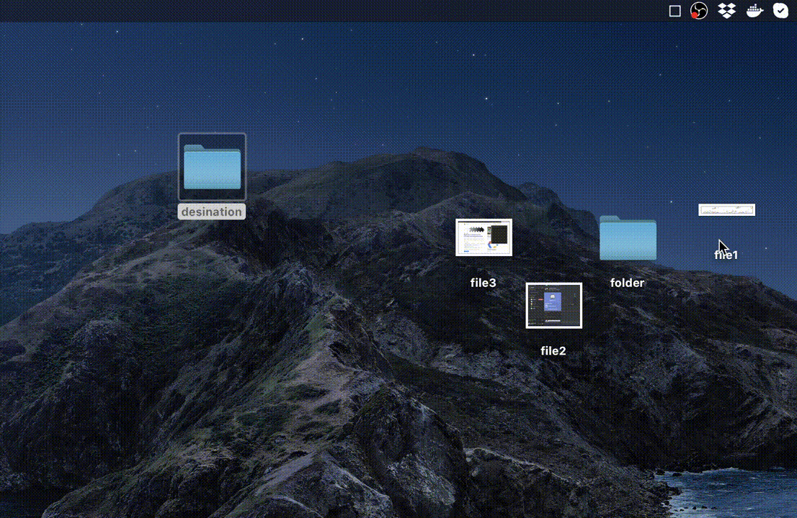

# FileHanger
Hang your files on the status bar to move them later (for MacOs). The files are not acually moved until you put them in the right place.

Download latest (and only) version: [v1 (zip containing an .app)](https://github.com/Bramas/FileHanger/releases/download/v1.0/FileHanger.zip)

This feature can be found in many paid applications such as [unclutter](https://unclutterapp.com),  [filepane](https://mymixapps.com/filepane) or [dropzone](https://aptonic.com). But **FileHanger** is a simple alternative offering just a way to temporarily put your file when you are moving them.

As you may see, **FileHanger** is open source, and the source code is quiet simple. There are few features I need to add such as auto-launch at startup, and also taking into accound key modifier to copy or move files accordingly. **Do not hesitate to send a pull-request**.

# How it works
### 1. Move your files on the icon on your status bar

### 2. Move all the files from the status bar to where you want

# Author
Quentin Bramas

# Licence
MIT
